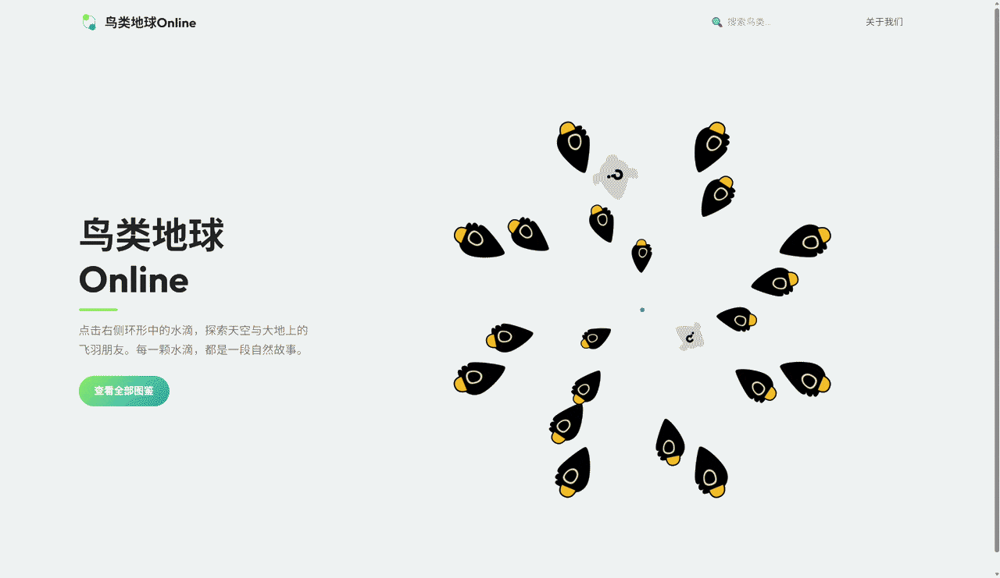

# 鸟类地球Online

本项目为**纯静态鸟类科普自适应官网**，基于 HTML + Tailwind CSS + 原生JavaScript 开发。

全站支持 PC/手机双端完美响应式适配，核心能力包含：科普图文展示、多图图集预览、B站视频自适应播放、全局柔和动效、首页水滴环形动态交互、前端JSON模糊搜索、模态框弹窗系统。

整体为**清新趣味极简科普UI**，风格轻盈柔和、层级干净、交互治愈，面向大众鸟类科普场景。

